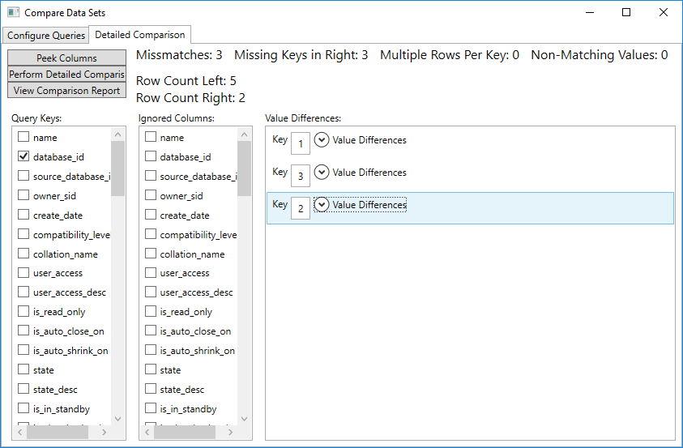

# About
Small windows application to execute two sql commands and compute the difference between them.

# Use cases
* You need to compare the contents of two tables.
* You need to compare the differences of a star schema model on separate dates (snapshots).
* You need to compare the differences between a query which you have refactored to make sure it still is returning the same result.
* You need to exactly identify which column have different values in two staging tables or on two different snapshots.

# The difference between this and other means of comparing data in SQL Server
This tool allow you to compare the result of any query. It will not only show you which rows which have missmatching values, it will give you the exact column and key for that row (and also displaying the actual vs the expected value).

This tool allow you to compare the result of queries on different servers. No need to setup linked servers or to copy data between servers just to do a comparison.

This tool will display missmatches based on selected key colums. It will also give a summerized report about which columns that had the most missmatches. This gives a quick overview of what is different even when there are many missmatches.

## Detailed view:
The detailed view allow you to compare queries based on selected key columns.

The detailed comparison result will show you which keys contain differences and also which columns that differ.

