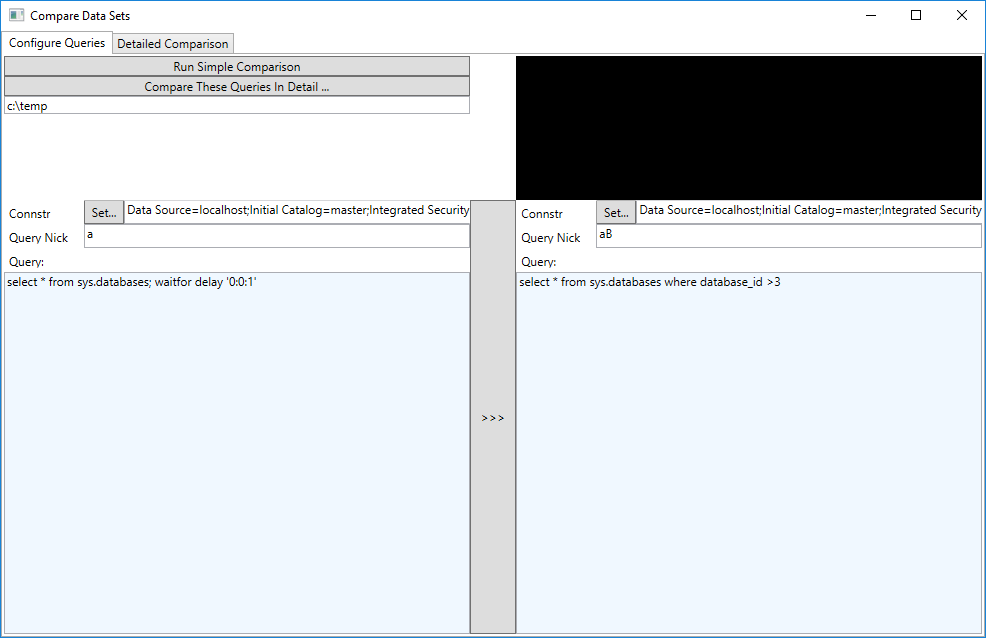

# GUI version
The GUI version has support for comparing result sets between different servers


# About
Small windows application to execute two sql commands and compute the difference between them.
Outputs csv files in the outputFolder.

Creates 4 files:
   * Raw_A.csv - the results from the first query.
   * Raw_B.csv - the results from the second query.
   * AvsB - the results of A EXCEPT B. Empty file = no differences
   * BvsA - the results of B EXCEPT A. Empty file = no differences

Uses windows authentication. Does not create any additional transactions, handle your own rollbacks!

# Where to get
The executable file is located in this repo under released-binaries

# Usage

```
  -o, --outputFolder    Required. Output folder where results will be stored.

  -s, --Server          Required. Server where to execute the queries

  -d, --Database        Required. Database where to execute the queries

  -a, --queryA          Required. First query.

  -b, --queryB          Required. Second query.

  --queryAType         (Default: Query) Type of first input.

  --queryBType         (Default: Query) Type of second input.

  --help                Display this help screen.

  Possible Query Types(for queryAType, queryBType):
   * Query     - Run the text as query specified in --queryA
   * CsvFile   - Load a csv file from filename specified in --queryA
  
```

# Example comparing two queries
```
LetsCompareDataSets.exe -o c:\temp -s LOCALHOST -d CustomerDB -a "Select * from sys.databases" -b "Select * from sys.databases"
```

# Example comparing query A on the server vs a CSV file on disk
```
LetsCompareDataSets.exe -o c:\temp -s LOCALHOST -d CustomerDB -a "Select * from sys.databases" -b "example-files\Raw_B.csv" --queryBType CsvFile
```

